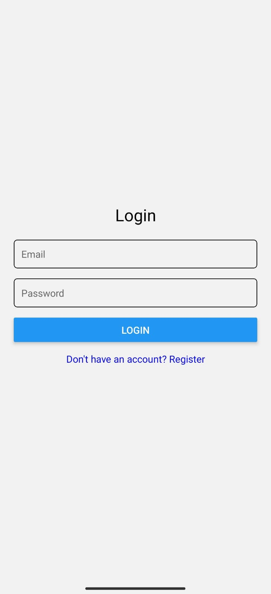
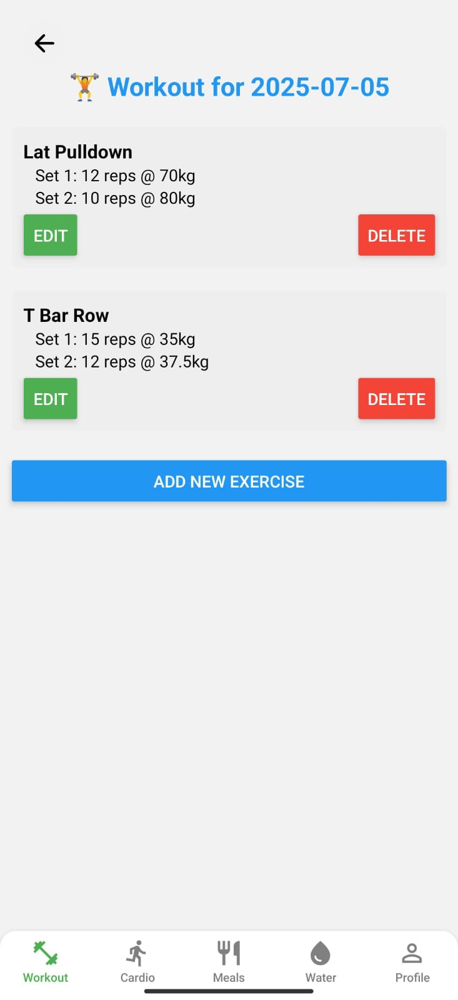

# 🏋️‍♂️ Fitness Tracker App

A **React Native fitness tracker** that lets you log your workouts, cardio sessions, meals, and water intake. Includes secure authentication with Firebase and a calendar-based UI to navigate daily logs.

This project is designed to help users stay on top of their fitness goals with an intuitive interface and smooth user experience.

---

## 🚀 Features

✅ **User Authentication**
- Login & Register with Firebase Authentication
- Profile completion after registration

✅ **Profile Management**
- Save & edit personal details (name, age, height, weight)
- Securely stored in Firebase Realtime Database

✅ **Workout Logging**
- Add exercises with sets, reps, and weights
- Edit or delete logged workouts

✅ **Cardio Logging**
- Record cardio sessions with duration and calories burned

✅ **Meal Logging**
- Track meals with calories, protein, carbs, and fats

✅ **Water Intake Tracking**
- Add daily water consumption logs

✅ **Calendar View**
- Navigate to any date and view/edit logs for that day

✅ **Cross-Platform UI**
- Designed for Android and iOS using React Native

---

## 🛠️ Tech Stack

- **Frontend:** React Native, React Navigation
- **Backend:** Firebase Authentication, Firebase Realtime Database
- **Local Storage:** AsyncStorage
- **UI Components:** React Native Elements, custom styling

---

## 📲 Screenshots

| Login Screen         | Calendar View         | Workout Log          |
|----------------------|------------------------|-----------------------|
|  |  |  |


---

## 🧑‍💻 Getting Started

### 1️⃣ Prerequisites

- Node.js >= 14
- npm or yarn
- Android Studio (for Android emulation) or Xcode (for iOS)
- Firebase Project (create one at [Firebase Console](https://console.firebase.google.com/))

---

### 2️⃣ Installation

```bash
# Clone the repo
git clone https://github.com/chandwaniarnav/fitnesstrackerapp.git
cd fitnesstrackerapp

# Install dependencies
npm install

```

---

### 3️⃣ Configure Firebase

1. Create a Firebase project at [Firebase Console](https://console.firebase.google.com/).
2. Enable **Email/Password Authentication** in Firebase Auth.
3. Add **Realtime Database** to your project.
4. Download your Firebase config and place it in `utils/firebaseConfig.js` like this:

```js
import firebase from 'firebase/app';
import 'firebase/auth';
import 'firebase/database';

const firebaseConfig = {
  apiKey: "<YOUR_API_KEY>",
  authDomain: "<YOUR_AUTH_DOMAIN>",
  databaseURL: "<YOUR_DATABASE_URL>",
  projectId: "<YOUR_PROJECT_ID>",
  storageBucket: "<YOUR_STORAGE_BUCKET>",
  messagingSenderId: "<YOUR_MESSAGING_SENDER_ID>",
  appId: "<YOUR_APP_ID>",
};

if (!firebase.apps.length) {
  firebase.initializeApp(firebaseConfig);
}

export { firebase };
```

---

### 4️⃣ Run the App

```bash
# Start Metro bundler
npx react-native start
```

In a separate terminal:

```bash
# For Android
npx react-native run-android

# For iOS
npx react-native run-ios
```

---

## 📂 Project Structure

```
fitness-tracker-app/
│
├── App.js                  # Main App Entry
├── screens/                # Screen components
│   ├── CalendarScreen.js
│   ├── WorkoutScreen.js
│   ├── CardioScreen.js
│   ├── MealScreen.js
│   ├── WaterScreen.js
│   ├── ProfileScreen.js
│   ├── LoginScreen.js
│   ├── RegisterScreen.js
│   └── CompleteProfileScreen.js
│
├── utils/
│   └── firebaseConfig.js   # Firebase setup
│
├── assets/                 # Images & assets
└── ...
```

---

## 🙌 Contributing

Pull requests are welcome! For major changes, please open an issue first to discuss what you would like to change.

---

## 📜 License

[MIT](LICENSE)

---

## 🌟 Acknowledgements

- [React Native](https://reactnative.dev/)
- [Firebase](https://firebase.google.com/)
- [React Navigation](https://reactnavigation.org/)
- [AsyncStorage](https://react-native-async-storage.github.io/async-storage/)
